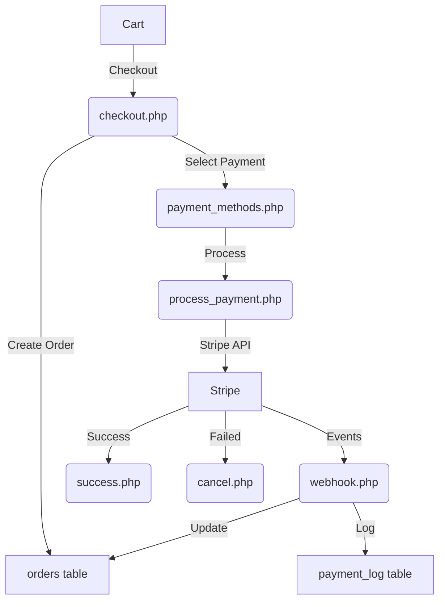

# 💳 VeroSports Payment System

A comprehensive, Stripe-powered payment processing system designed for the VeroSports e-commerce platform. Built with security, idempotence and traceability as core principles.

## 📋 Overview

| Component | Purpose |
|-----------|---------|
| Checkout Flow | Multi-step order creation and payment experience |
| Payment Processing | Secure Stripe integration with idempotency |
| Webhook Handling | Real-time payment event processing |
| Comprehensive Logging | Detailed audit trail of all transactions |
| Security Controls | CSRF, XSS and SQL injection protection |

## 🔄 Payment Flow Architecture



## 🧩 Core Components

### 1️⃣ Checkout (`checkout.php`)
- Order summary with shipping information form
- Creates a pending order record in database
- Handles shipping address validation and storage
- Sets up the checkout session state

### 2️⃣ Payment Methods (`payment_methods.php`)
- Payment selection interface (currently Stripe cards)
- CSRF-protected form submission
- Secure payment flow state management
- Multi-device session tracking

### 3️⃣ Payment Processing (`process_payment.php`)
- Stripe SDK integration for payment processing
- Idempotent transaction handling
- Detailed error management with fallbacks
- Records all attempts in `payment` table
- Implements various payment flow security validations

### 4️⃣ Webhook Handler (`webhook.php`)
- Signature verification for Stripe events
- Asynchronous order and payment status updates
- Event handlers for:
  - `payment_intent.succeeded`
  - `payment_intent.payment_failed`
  - `charge.refunded`
- Idempotency checks to prevent duplicate processing

### 5️⃣ Result Pages
- `success.php`: Order confirmation with details
- `cancel.php`: Payment failure handling with suggestions

## 📊 Database Schema

### Tables Structure

| Table | Primary Purpose | Key Fields |
|-------|----------------|------------|
| `orders` | Order information | order_id, user_id, delivery_status |
| `order_items` | Products in orders | order_item_id, product_id, quantity |
| `payment` | Payment transaction data | payment_id, stripe_id, status |
| `payment_log` | Audit trail entries | log_id, payment_id, log_message |

### Key Database Operations

```sql
-- Idempotent payment record insertion
INSERT INTO payment (
    payment_id, order_id, total_amount, 
    payment_status, payment_method, stripe_id
) VALUES (
    :payment_id, :order_id, :amount, 
    :status, :method, :stripe_id
)
ON DUPLICATE KEY UPDATE 
    last_error = VALUES(last_error),
    payment_status = IF(payment_status = 'completed', payment_status, VALUES(payment_status));
```

## 🛠️ Setup & Configuration

### Prerequisites
- PHP 7.4+ with PDO MySQL extension
- Composer for dependencies
- Stripe account with API keys

### Installation

1. **Clone & Install Dependencies**
   ```bash
   git clone <repo-url>
   cd FYP/User/payment
   composer install
   ```

2. **Environment Configuration**
   Create a `.env` file from the template:
   ```ini
   STRIPE_SECRET_KEY=sk_test_...
   STRIPE_WEBHOOK_SECRET=whsec_...
   STRIPE_PUBLIC_KEY=pk_test_...
   DB_DSN=mysql:host=localhost;dbname=verosports;charset=utf8mb4
   DB_USER=root
   DB_PASS=
   LOG_LEVEL=info
   ```

3. **Directory Preparation**
   ```bash
   mkdir -p logs
   chmod 775 logs
   ```

4. **Database Setup**
   - Import database schema
   - Verify tables: `orders`, `order_items`, `payment`, `payment_log`

5. **Local Webhook Testing**
   ```bash
   # Using Stripe CLI
   npm install -g stripe-cli
   stripe login
   stripe listen --forward-to "http://localhost/FYP/User/payment/webhook.php"
   ```

## 🔒 Security & Best Practices

| Area | Implementation |
|------|---------------|
| **CSRF Protection** | Token validation on all forms |
| **SQL Injection Prevention** | PDO prepared statements only |
| **XSS Defense** | `htmlspecialchars()` on all output |
| **Monetary Precision** | All amounts stored as integers (cents/pence) |
| **Code Standards** | PSR-12 with `declare(strict_types=1);` |
| **Error Handling** | Structured exception handling with logging |
| **Idempotency** | Transaction ID checking to prevent duplicates |

## 💡 Developer Guidelines

### Logging Best Practices
```php
// Critical payment events
$logger->info('Payment successful', [
    'payment_id' => $paymentId,
    'order_id' => $orderId,
    'amount' => $amount,
    'user_id' => $userId
]);

// Errors with sensitive data redaction
$logger->error('Stripe API error', [
    'code' => $e->getCode(),
    'message' => $e->getMessage(),
    'order_id' => $orderId,
    // Never log full card details or security codes
]);
```

### Idempotent Processing
Ensure all payment operations can be safely retried:

1. Always use idempotency keys with Stripe
2. Check database for existing records before creating new ones
3. Design update operations to be repeatable without side effects

### Transaction Handling

```php
try {
    $db->beginTransaction();
    
    // Update payment record
    $db->execute("UPDATE payment SET payment_status = ? WHERE payment_id = ?",
        ['completed', $paymentId]);
    
    // Update order status
    $db->execute("UPDATE orders SET delivery_status = ? WHERE order_id = ?",
        ['prepare', $orderId]);
    
    // Log the transaction
    $db->execute("INSERT INTO payment_log (payment_id, log_level, log_message) 
                 VALUES (?, ?, ?)",
        [$paymentId, 'info', 'Payment completed successfully']);
    
    $db->commit();
} catch (Exception $e) {
    $db->rollback();
    $logger->error('Transaction failed', ['error' => $e->getMessage()]);
}
```

---
